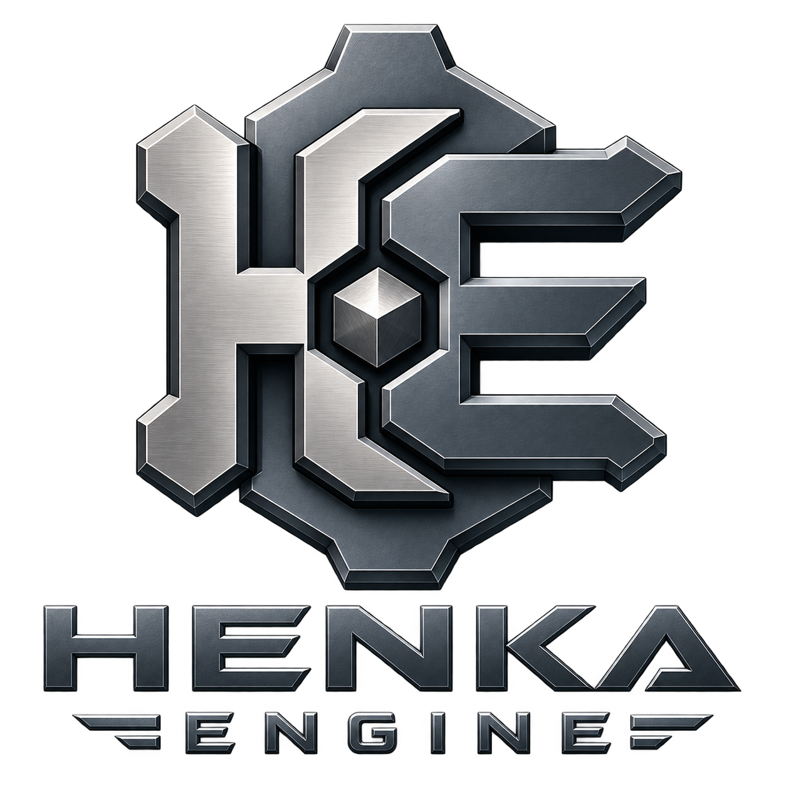

<p align="center">
  
</p>

# Henka Engine

Henka Engine is an early-stage open-source C17 game engine and integrated
development workspace. It has a native 3D runtime/editor path, terrain,
rendering, physics, Audio foundations, 2.5D camera foundations, modeling and
content authoring, asset/material workflows, persistence, and external-project
support.

> **Project status:** Henka is a real engine foundation. Production-ready game-platform maturity is still in progress. The repository's Sandbox is an engine sample and QA target. Games built with Henka should live in separate repositories.

## At a glance

| Area | Current direction |
| --- | --- |
| Language | C17 |
| Primary validated platform | 64-bit Windows |
| Planned desktop platforms | Linux 64-bit, then macOS |
| Current renderer backend | OpenGL |
| Future renderer direction | Vulkan / Direct3D 12 / Metal through backend isolation |
| Editor | Native integrated workspace |
| Game project boundary | Separate external projects supported through validated templates |
| Major system sequence | Audio completion → Character Controller → Scene Hierarchy / Parenting → Prefabs |
| License | MIT |

Integrated authoring is underway alongside runtime and workspace hardening. The
current validated development and packaging path targets 64-bit Windows with
MSVC, CMake, PowerShell, SDL3, and the OpenGL renderer backend. Linux and macOS
support are planned and will be claimed only after their real build, test,
runtime, packaging, and external-project paths are validated.

## Highlights

- C17 runtime architecture with renderer-independent `henka_runtime`
- Native editor/workspace with docked and detached tools
- Camera-driven Scene View Compass with snap, orbit, projection, and persisted preferences
- glTF/GLB scene and PBR material workflow plus bounded OBJ loading
- Integrated Object/Vertex/Edge/Face authoring with stable mesh-element identities
- Transactional topology operations, UV foundations, and bounded undo/redo
- Terrain streaming, editing, persistence, material layers, and collision ownership
- Rigid-body physics foundation with Sandbox inspection
- Bounded game-audio foundation with buses, spatial emitters, scene/Play integration, SDL3 output, and external public-API validation
- Perspective, side, top-down, and isometric 2.5D camera foundations
- Headless/dedicated-server and external-project template foundations
- Provenanced, packaged Windows Sandbox builds

> **Support Henka Engine** — Development is supported through GitHub Sponsors.
> Use this repository's Sponsor button or read [SUPPORT.md](SUPPORT.md) for
> details.

## Capability matrix

| Area | Current status | Supported scope / highlights |
| --- | --- | --- |
| Core runtime | Available | Current C17 runtime APIs, bounded validation, and generation-checked scene identities |
| Renderer | Available (Unhardened) | Current OpenGL path, Solid/Material Preview/Rendered policies, and PBR foundations |
| Scene and camera | Available (Unhardened) | Current 3D entities, input actions, framing, gizmos, Compass, and 2.5D camera presets |
| Editor workspace | In Progress | Current native docking, detached panels, tabs, layout persistence, and early authoring UI |
| Modeling and authoring | In Progress | Current direct Object/Vertex/Edge/Face modes, bounded topology operations, UV, and HAMS foundations |
| Assets and materials | In Progress | Current glTF/GLB and OBJ loading, manager-owned dependencies, and validated instances |
| Terrain and world | Foundation | Current bounded four-layer terrain, streaming, edits, LOD, persistence, and collision paths |
| Physics | Foundation | Current fixed-step rigid bodies, primitive colliders, contacts, events, and raycasts |
| 2.5D | Foundation | Camera-side foundation only: perspective/side/top/isometric workflows and orthographic zoom |
| Networking/server | Foundation | Current renderer-free runtime, dedicated host, and bounded Terrain authority paths |
| External projects | Foundation | Current separate game/server templates with Windows validation |
| Game authoring | Foundation | Current bounded Scene Document, authored Physics/Interaction, Save/Reload, and isolated runtime Play scenes |
| 2D | Planned | No dedicated 2D scope yet; renderer, sprites, layers, parallax, and animation remain open |
| Audio | Foundation | Resident WAV clips, fixed voices, buses, spatialization, deterministic mixing, manager-owned assets, persisted emitters, Sandbox Play integration, caller-pumped SDL3 output, and external public-API validation |
| Scripting/behaviors | In Progress | Current bounded HenkaScript/Lua lifecycle adapters, Scene Document binding, Play dispatch, persistence, and cross-language events |

### Status meanings

| Status | Meaning |
| --- | --- |
| **Foundation** | Core architecture exists, but the category is incomplete. |
| **In Progress** | Substantial implementation exists while major functionality remains. |
| **Available (Unhardened)** | The functional category is present, but hardening or validation remains. |
| **Available** | The category is functionally complete and hardened for its stated scope. |
| **Planned** | Meaningful implementation has not yet begun. |

The maintained status ownership and authoritative detailed sections are recorded
in [docs/capability-statuses.tsv](docs/capability-statuses.tsv) and
[docs/current-capabilities.md](docs/current-capabilities.md).

## Editor and development workspace

The Sandbox provides a native workspace for Scene View, utilities, object
inspection, physics QA, materials, terrain, authoring, and layout tools.

Current workspace foundations include:

- docked and detached panels;
- validated split topology and tabs;
- named layout slots and bounded layout history;
- reset-layout recovery;
- camera-driven Compass navigation and projection controls.

Detailed controls are documented in
[docs/help/sandbox3d.md](docs/help/sandbox3d.md) and
[docs/editor-controls.md](docs/editor-controls.md).

## Game-engine runtime

Henka's runtime currently includes:

- scenes and entities;
- camera and input actions;
- asset management;
- rendering;
- physics;
- terrain;
- persistence;
- scripting/behavior foundations;
- a renderer-independent headless boundary;
- a bounded Audio runtime and graphical Sandbox output path.

Character controllers, complete end-user scripting workflows, mature project
serialization, and broader Game/Play authoring remain unfinished. Audio has a
bounded headless runtime, manager-owned asset path, persisted emitters, Sandbox
Play integration, graphical client output, and external public-API validation.
Editor authoring, streaming, broader decoding, scripting, and device-recovery
work remain active.

## Modeling and content authoring

The current integrated authoring foundation includes:

- Object, Vertex, Edge, and Face workflows
- Component selection, connected selection, bounded edge-loop selection, and soft movement
- Transform, orientation, pivot, and axis-constrained editing foundations
- Stable vertex/edge/face identities and connectivity queries
- Face winding flip, extrude, inset, bevel-ring, face subdivision, selected-face deletion, UV projection, packing, and undo/redo
- Native editable source persistence and imported-object Make Editable
- Validated material-region and supported PBR material-instance editing

Broader topology, automatic UV unwrap, texture painting, rigging, animation
authoring, and production-quality showcase asset creation remain in progress.
See [docs/authoring-mesh.md](docs/authoring-mesh.md) and
[docs/showcase-assets.md](docs/showcase-assets.md).

## Terrain, world, and 2.5D

Terrain provides bounded region persistence and streaming, four-layer material
data, resident render/physics owners, sculpt/paint commands, collision patches,
LOD transitions, and edit history.

The current 2.5D foundation is camera-side:

- Perspective
- Side
- Top-down
- Isometric
- Orthographic zoom

Sprites, texture regions, layered depth, parallax, animation, and movement
constraints remain future work. See [docs/terrain.md](docs/terrain.md) and
[docs/roadmap.md](docs/roadmap.md).

## Platform direction

The current validated platform is 64-bit Windows.

Planned desktop support includes:

- Linux 64-bit with a validated native build, test, runtime, packaging, and external-project path;
- macOS after the portable runtime/platform boundary and renderer abstraction are ready for a Metal-oriented path.

Renderer backend direction is:

- Windows: OpenGL today, with future Vulkan and Direct3D 12 support;
- Linux: Vulkan as the preferred modern backend, with OpenGL retained where practical;
- macOS: Metal as the intended native modern backend.

See [docs/platform-support.md](docs/platform-support.md) for the platform validation contract.

## Getting started

### Prerequisites

- 64-bit Windows
- Visual Studio with C/C++ build tools
- CMake
- Network access on the first configure unless the pinned dependencies are already cached

### Build and test

```powershell
git clone <repository-url>
cd HenkaEngine
.\scripts\build_windows.ps1 -Configuration Debug
.\scripts\test_windows.ps1 -Configuration Debug
```

The detailed build, dependency, headless, Release, and package instructions are
in [docs/building.md](docs/building.md).

### Run the Sandbox

```powershell
.\scripts\run_sandbox3d.ps1 -Configuration Debug
```

### Create and run a package

```powershell
.\scripts\package_sandbox3d_windows.ps1 -Configuration Debug
.\scripts\run_packaged_sandbox3d_windows.ps1
```

The run-ready folder is `out/HenkaSandbox3D/`. It contains the executable,
assets, offline help, package identity, and local user settings when present.
Packaging and recovery rules are documented in
[docs/package-provenance.md](docs/package-provenance.md).

## Using Henka from another project

Henka keeps engine code and samples separate from actual games. Put game-specific
assets, scenes, saves, scripts, and private content in another repository. The
starter projects under `templates/` demonstrate the public runtime boundary:

```powershell
cmake -S . -B build -DHENKA_ENGINE_DIR="C:/Path/To/HenkaEngine"
.\scripts\test_external_game_template_windows.ps1
```

The external server template links only `henka_runtime`. The external game
template exercises bounded public runtime and authoring paths, including the
current public Audio workflow. Complete game project serialization remains future work. See
[docs/external-game-projects.md](docs/external-game-projects.md).

## Documentation

### Start here

- [Detailed current capabilities](docs/current-capabilities.md)
- [Roadmap](docs/roadmap.md)
- [Architecture](docs/architecture.md)
- [Building and validation](docs/building.md)
- [Documentation presentation standard](docs/documentation-style.md)
- [Platform support](docs/platform-support.md)

### Subsystems and workflows

- [Runtime foundations](docs/runtime-foundations.md)
- [UI and workspace](docs/ui.md)
- [Model loading](docs/model-loading.md)
- [Terrain](docs/terrain.md)
- [Physics](docs/physics.md)
- [Audio foundation](docs/audio.md)
- [Editor controls](docs/editor-controls.md)
- [Sandbox offline help](docs/help/sandbox3d.md)
- [External game projects](docs/external-game-projects.md)
- [Showcase asset provenance](docs/showcase-assets.md)
- [Rendering realism](docs/realism.md)
- [Branding](docs/branding.md)
- [Repository integrity](docs/repository-integrity.md)
- [Contributing](CONTRIBUTING.md)

## Current limitations

The supported scope for each capability row is stated in its matrix cell above.
Future expansion beyond that scope does not lower a current status. Unfinished
work inside the stated scope still affects status.

- Henka and its editor are early-stage; the native workspace is not a complete production editor.
- 2D, authored Audio workflows, scripting/behaviors, character controllers, advanced physics, broader renderer backends, and mature Game/Play workflows are unfinished.
- Scene/project serialization, hierarchy authoring, texture painting, automatic UV unwrap, rigging, animation, and several advanced topology tools remain open.
- The default Giraffe and Rocket are deterministic imported/generated fixtures and editor-owned dogfood derivatives. They do not establish user-authored production-asset maturity.
- Automated evidence does not replace human visual QA for editor feel, detached windows, terrain corners, rendering, or modeling quality.

The detailed boundary inventory is maintained in
[docs/current-capabilities.md](docs/current-capabilities.md), with subsystem
contracts owned by the linked documentation above.

## Roadmap

The current major-system sequence is:

1. Complete the Audio campaign to its defined production boundary.
2. Build the Character Controller foundation.
3. Mature Scene Hierarchy / Parenting.
4. Build Prefabs / Reusable Scene Objects on the hierarchy foundation.

Parallel and later work continues across renderer and realism maturity,
integrated authoring, terrain/world systems, 2D/2.5D, animation, gameplay
infrastructure, tooling, additional renderer backends, and release distribution.
See the maintained [roadmap](docs/roadmap.md) for the full direction.

## Support Henka Engine

Henka sponsorship supports development time, testing, documentation, examples,
packaged builds, asset workflow work, and future workspace/tooling work. Use the
[GitHub Sponsors page](https://github.com/sponsors/bconnell) or this repository's
Sponsor button.

Sponsorship is voluntary support. It does not purchase feature priority,
private support, guaranteed response times, ownership, project-direction
control, or a different license. Feature decisions remain based on stability,
maintainability, scope, and usefulness to the wider engine. See
[SUPPORT.md](SUPPORT.md) for the full terms and other ways to help.

## License

Henka Engine is available under the [MIT License](LICENSE).
