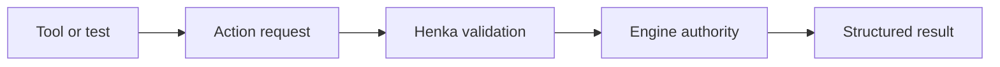

# Action API

> **Status:** Foundation

Henka Engine includes a local Action API for validated scene and object operations. The engine owns authority, tools submit requests, Henka validates them, and each request returns a structured result.

## Contents

- [Action flow](#action-flow)
- [V1 capability](#v1-capability)
- [Structured results](#structured-results)
- [Dry-run validation](#dry-run-validation)
- [Selection and helper safety](#selection-and-helper-safety)
- [Creation transaction safety](#creation-transaction-safety)
- [Viewport interaction testing](#viewport-interaction-testing)
- [Current limitations](#current-limitations)

## Action flow

The Action API is local engine infrastructure. Network services, cloud bridges, scripting runtimes, plugin loading, and arbitrary code execution are outside the V1 boundary.

## V1 capability

The current action context supports:

- scene summary queries;
- object listing;
- primitive-backed logical scene-object creation;
- object deletion and rename;
- object selection and selection clearing;
- selected-object lookup;
- object-detail queries;
- position, rotation, and scale assignment;
- movement and rotation by delta;
- scaling by multiplier;
- transform reset when a default transform is registered;
- visibility changes;
- camera focus when a camera context is attached.
- parent and unparent operations through the runtime hierarchy API, with
  explicit keep-local or keep-world behavior.

### Primitive creation

The current primitive creation path produces a valid logical scene object with:

- a name;
- a tag;
- transform state;
- visibility state;
- local bounds.

Mesh and material assignment remain separate responsibilities.

## Structured results

Every action returns a `henka_action_result` with bounded state for tools and tests.

| Result field | Purpose |
| --- | --- |
| Success/failure | Reports whether the request completed. |
| Command name | Identifies the requested operation. |
| Action status | Reports Action API classification. |
| Engine result | Preserves the underlying Henka result. |
| Affected entity | Identifies the target when applicable. |
| Selected entity | Reports selection state when applicable. |
| Before transform | Captures the prior transform for relevant mutations. |
| After transform | Captures the committed transform for relevant mutations. |
| Scene summary | Carries scene-level query output. |
| Object details | Carries object-level query output. |
| Status message | Provides short bounded diagnostics. |

This result contract lets automation verify the actual outcome of a request.

## Dry-run validation

`henka_action_validate` runs the same validation path used by execution and leaves scene state unchanged.

Useful cases include:

- expected-failure testing;
- transform validation before mutation;
- workspace preflight checks;
- deterministic automation checks.

Dry-run leaves object count, transforms, visibility, and selection unchanged.

## Selection and helper safety

Action API V1 rejects internal helper entities as normal user-object targets.

Protected operations include:

- selection;
- rename;
- transform mutation;
- visibility changes;
- camera focus.

This keeps viewport helpers outside ordinary user-object authority.

Hierarchy actions reject helper or stale parent handles, transform-locked
children, invalid parenting modes, and cycle-producing relationships. A
rejected relationship leaves the scene hierarchy unchanged. The Sandbox
outliner, hierarchy history, and broader editor authoring surface remain
separate work.

## Creation transaction safety

Primitive creation validates the primitive enum, bounded object name, and transform before publication.

Execution applies the object setup as one bounded operation:

1. create the entity;
2. assign transform;
3. assign visibility;
4. assign bounds;
5. assign tag;
6. register the default transform;
7. construct object details.

Any setup failure removes the new entity and registered default transform before the structured failure is returned.

## Viewport interaction testing

The viewport interaction helpers work alongside the Action API:

- viewport coordinate conversion;
- world-to-screen projection;
- projected gizmo handle models;
- screen-space gizmo hit testing;
- deterministic gizmo drag math.

Together they let executable tests prove outcomes such as:

- the selected object moved;
- the selected object rotated;
- the selected object scaled;
- a near-gizmo click preserved the intended object selection.

Human desktop QA still covers handle readability, drag comfort, and overall interaction feel.

## Current limitations

- V1 uses current entity handles. Persistent project object IDs are a later authority layer.
- Reset Transform requires a registered default transform.
- Primitive creation does not perform full asset instancing.
- Scene saving is outside this API.
- Undo and redo are outside this API.
- Scripting, plugins, networking, and assistant runtime control are separate systems.
