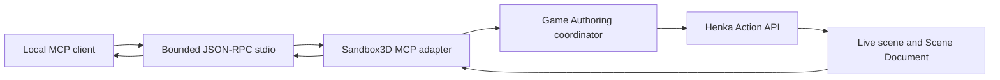

# MCP QA Harness

> **Status:** Foundation

Henka Sandbox3D provides a bounded local MCP adapter for executable inspection
and semantic editor checks. The adapter exposes the existing Henka Action API
and Scene Document mapping; it does not create a second scene or identity
authority.

## Current scope

| Capability | Availability | Production authority |
| --- | --- | --- |
| Capability discovery | Available | MCP protocol adapter |
| Live scene observation | Available | Scene, viewport, and Action API state |
| Persistent-object selection | Available | Scene Document ID resolved by Game Authoring, then Action API selection |
| Clean candidate exit | Available | Henka engine lifecycle |
| Component editing | Planned | Modeling and authoring systems |
| Framebuffer capture | Planned | Renderer and visual-proof path |
| Undo, redo, save, and reload workflow | Planned | Authoring and persistence systems |

The initial adapter is intentionally small. A tool is added only when the
same operation is available through a supported Henka product path.

## Protocol boundary

The adapter uses newline-delimited JSON-RPC over local standard input/output
and reports MCP protocol revision `2026-07-28`. Each request is independent;
the adapter does not create a session or retain scene state between requests.
The `server/discover` response identifies the current candidate and advertised
tools. `tools/list` returns bounded input schemas.



## Advertised tools

### `henka.observe`

Reads authoritative live state, including:

- render revision;
- framebuffer and scene-viewport dimensions;
- active shading mode;
- persistent Scene Document IDs and live runtime entities;
- object names, visibility, and selection state;
- authoring geometry revision, selection mode, selected-component count, and
  topology counts when an object has an authoring mesh.

### `henka.select_object`

Accepts a persistent Scene Document ID. The Game Authoring coordinator resolves
that ID to the live entity, then the existing `HENKA_ACTION_COMMAND_SELECT_OBJECT`
path performs the selection. Missing or stale IDs return a structured semantic
error and do not silently select another object.

### `henka.exit`

Requests clean shutdown of the local Sandbox3D candidate. It does not terminate
arbitrary processes or provide shell, filesystem, or operating-system control.

## Candidate identity

Launchers may provide `HENKA_CANDIDATE_ID`. The adapter reports that bounded
value in structured results so a harness can associate observations with the
executable it started. Candidate identity is provenance metadata, not a product
object ID and not an authorization mechanism.

## Validation

The protocol core has unit coverage for bounded parsing, discovery, tool
schemas, structured semantic errors, oversized requests, and callback routing.
The Windows production smoke starts the real packaged Sandbox3D executable and
proves this chain:

```text
live Sandbox3D scene
  -> server/discover and tools/list
  -> observe a real scene object
  -> resolve its persistent Scene Document ID
  -> select it through the canonical Action API
  -> observe the resulting live selection
  -> reject an invalid persistent ID
  -> request clean exit
```

The smoke validates that protocol output remains on stdout while product
diagnostics remain on stderr. It uses a bounded progress-aware response
deadline rather than waiting for a fixed startup log line.

## Security and ownership boundaries

- The adapter is local-first and has no network listener.
- Request and response sizes are bounded.
- Product state, entity handles, persistent IDs, and mutations remain owned by
  Henka systems.
- MCP clients cannot invoke arbitrary shell commands, read arbitrary files, or
  bypass Action API validation.
- An MCP request cannot establish a capability that is absent from the normal
  editor, runtime, or public API path.

The MCP adapter is an interoperability and validation surface. It is not a
replacement for the editor, the Action API, the Scene Document, or the
renderer.
