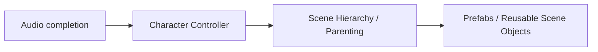

# Roadmap

Henka Engine is an early-stage open source C game engine and integrated development workspace. The active work combines runtime and integrity hardening with the already-underway modeling/content-authoring foundation, terrain/world usability, renderer and asset hardening, and the next layers of 2.5D while retaining external-pipeline compatibility.

> **Roadmap status:** This is a direction guide, not a release schedule. Priorities may change as the engine matures, testing finds issues, or core systems need more hardening. Capability claims remain governed by the current implementation and the repository's capability documentation.

## Contents

- [Current focus](#current-focus)
- [Active major-system sequence](#active-major-system-sequence)
- [Near-term priorities](#near-term-priorities)
- [Character Controller](#character-controller)
- [Scene Hierarchy / Parenting Maturity](#scene-hierarchy--parenting-maturity)
- [Prefabs / Reusable Scene Objects](#prefabs--reusable-scene-objects)
- [Roadmap dependency map](#roadmap-dependency-map)
- [Workspace and tools](#workspace-and-tools)
- [Agent and automation interface](#agent-and-automation-interface)
- [Game authoring foundation](#game-authoring-foundation)
- [Asset and material workflow](#asset-and-material-workflow)
- [2D and 2.5D direction](#2d-and-25d-direction)
- [Integrated modeling and content authoring](#integrated-modeling-and-content-authoring)
- [Persistence and undo/redo](#persistence-and-undoredo)
- [Scripting and behavior authoring](#scripting-and-behavior-authoring)
- [Game-completion and future engine systems](#game-completion-and-future-engine-systems)
- [Longer-term platform and release systems](#longer-term-platform-and-release-systems)

## Current focus

The current work is focused on repairing and hardening runtime, workspace, renderer, platform, asset, physics, persistence, packaging, and external-project paths while strengthening the integrated authoring foundation already present in the Sandbox.

Current priorities include:

1. Stable engine startup and shutdown.
2. Clear platform, renderer, input, scene, camera, and authoring boundaries.
3. Reliable object/component selection and transform behavior.
4. Transactional modeling, UV, material, persistence, and undo/redo paths.
5. Terrain editing, streaming, collision, and visual validation.
6. Asset loading and material ownership with explicit failure behavior.
7. A packaged sandbox that can be tested without private setup.
8. Documentation that stays aligned with what the engine actually does.
9. Test coverage for core behavior that should not depend on manual QA.

## Active major-system sequence

The current intended major-system order is:

1. **Complete Audio** to its defined production boundary.
2. **Character Controller** as the next major gameplay project.
3. **Scene Hierarchy / Parenting Maturity** as the next composition foundation.
4. **Prefabs / Reusable Scene Objects** on top of the mature hierarchy.

This sequence does not cancel renderer, realism, modeling, terrain, 2D/2.5D, scripting, or other roadmap work. It establishes which major system campaign should lead when the current campaign reaches a clean boundary.

## Near-term priorities

The next development work remains bounded repair and verification.

1. Finish asset cache ownership, identity, retry, metadata, and failure-output contracts.
2. Continue recursive audits across rendering, platform, physics, persistence, scene, workspace, packaging, and external-project paths.
3. Keep viewport interaction helpers aligned with the real sandbox behavior and complete remaining manual transform QA.
4. Keep local and GitHub validation deterministic across build, tests, package provenance, packaged startup, repository integrity, and external-project checks.
5. Keep the README, architecture, roadmap, runtime help, and repository description aligned with the implemented product.
6. Preserve stable identities, transactional editing boundaries, versionable data, and external-tool compatibility needed by 2.5D and later modeling.
7. Shape the existing Action API toward a versioned semantic agent surface, while deferring any MCP/WebMCP-compatible bridge until stable Scene Document identities, explicit capability discovery, permission boundaries, dry-run behavior, auditability, and structured failure contracts are dependable.

## Character Controller

> **Status:** Planned next major project after Audio reaches a coherent completion boundary.

The Character Controller should be a production gameplay foundation suitable for first-person, third-person, and general character movement. A freely moving capsule is not sufficient to claim this system complete.

### Target capability

The production foundation should cover:

- grounded detection and stable floor classification;
- walking and running with configurable acceleration and deceleration;
- jumping, falling, and gravity integration;
- configurable movement speed and movement policy;
- slope handling and explicit slope limits;
- stairs and bounded step handling;
- ledge and contact behavior;
- moving-platform participation;
- crouch and stand-clearance checks;
- collision recovery and wall/contact handling;
- configurable step height, skin/contact margin, and surface response;
- first-person and third-person use;
- keyboard, mouse, and gamepad integration through the real input boundary;
- runtime camera integration;
- physics participation without a competing movement simulation;
- animation hooks;
- Audio and footstep hooks;
- scripting/gameplay APIs;
- persisted authored settings;
- deterministic tests and real production-object integration tests;
- packaged and external-project validation;
- architecture compatible with later gameplay networking.

### Integration expectations

The controller must consume the same authoritative scene/entity, transform, input, camera, physics, Audio, scripting, and future animation boundaries used elsewhere in Henka. Editor-only proxies or test-only substitutes do not establish completion.

### Completion direction

A mature controller should remain stable across slopes, steps, moving platforms, pause/resume, scene save/load, runtime Play, package execution, and supported external projects. Failure cases such as blocked standing, invalid grounding, stale entity ownership, and unsupported movement states should fail predictably rather than silently desynchronize systems.

## Scene Hierarchy / Parenting Maturity

> **Status:** Planned after Character Controller reaches its appropriate maturity target.

The hierarchy project establishes how real Henka objects compose. The target is not merely that an entity can store a parent reference; the editor, runtime, persistence, scripting, and major subsystems must agree on one authoritative scene relationship model.

### Core hierarchy

The hierarchy should support:

- root, parent, child, sibling, and deeply nested descendant relationships;
- stable parent/child identity;
- deterministic traversal and ordering where ordering matters;
- cycle prevention and stale-parent rejection;
- safe mutation during editor and runtime operations;
- explicit ownership and destruction behavior;
- bounded traversal for malformed or hostile data.

### Transform authority

Local and world position, rotation, and scale must propagate through the real hierarchy. Reparenting should support explicit **keep world transform** and **keep local transform** behavior where appropriate.

Rendering, physics, Audio, cameras, scripting, animation hooks, networking, persistence, and Play sessions must observe the same transform truth.

### Authoring and persistence

Hierarchy maturity includes:

- tree/outliner presentation;
- selection synchronization with the viewport;
- parent, unparent, reparent, duplicate, rename, and delete operations;
- subtree duplication with new stable identities and correct internal reference remapping;
- undo/redo for hierarchy edits;
- exact save/reload round trips;
- safe lifecycle behavior when roots, parents, children, or subtrees are destroyed;
- package and external-project verification.

A weapon attached to a hand, an Audio emitter attached to a world object, a camera attached to a player rig, and a light attached to a vehicle should all rely on this same hierarchy rather than separate attachment systems.

## Prefabs / Reusable Scene Objects

> **Status:** Planned on top of the mature scene hierarchy.

Prefabs establish how real scene compositions become reusable authored game content. They should instantiate normal Henka scene objects and must not create a parallel fake runtime representation.

### Core prefab capability

A prefab system should provide:

- stable prefab asset identity;
- traceable source-to-instance relationships;
- real scene-entity instantiation;
- preserved hierarchy and component data;
- explicit inherited versus overridden values;
- instance-specific overrides;
- source-change propagation that preserves intentional overrides;
- structural reconciliation when children/components are added or removed;
- duplication, unpacking, and deliberate apply/revert operations;
- persistence of source identity, instance identity, mappings, overrides, and schema/version information;
- asset move/rename resilience through stable identity rather than filename-only authority;
- cycle prevention for nested prefab dependencies;
- safe failure for missing, stale, corrupt, or unsupported sources;
- undo/redo participation;
- package and external-project validation.

### Composition direction

Prefab architecture should be compatible with nested reusable objects, controlled variants or an equivalent composition mechanism, runtime spawning, Character Controller integration, Audio emitters, scripting, imported assets, future networking, and future Smart Objects.

Advanced nested prefab and variant behavior may be staged, but unsupported behavior should be documented rather than silently flattened and claimed as complete.

## Roadmap dependency map

The roadmap is not purely linear. Several later systems depend on shared foundations.

| Cluster | Dependency direction |
| --- | --- |
| Character gameplay | Character Controller → Input → Camera → Physics → Animation → Audio → Gameplay AI → Networking |
| Scene composition | Scene Hierarchy → Asset Identity → Prefabs → Persistence → Streaming → Smart Objects → Large Worlds |
| Content | Asset Pipeline → Materials → VFX → Vegetation → Water → Animation → Audio → Packaging |
| Game completion | Runtime UI → Input → Localization → Accessibility → Save Games → Project/Build/Export |
| Shipping and scale | Profiling → Loading/Streaming → Large Worlds → Packaging → Crash Diagnostics → Team Workflows |

The table expresses dependency leverage, not a strict chronological requirement for every subsystem.

## Workspace and tools

Henka is moving toward a practical developer workspace, but this should happen in layers.

### Current workspace foundations

1. Docked panels with a dedicated Scene View.
2. Native detached tool windows with matching production-panel content, close-to-redock recovery, bounded virtual-screen placement persistence, and title-bar drag-back recognition.
3. Resizable occupied dock regions, validated split topology, tab grouping/reordering, bounded layout history, named layout slots, and reset-layout recovery.
4. Scrollable panel bodies with bounded wheel/touchpad ownership, persistent collapsible property groups and scroll offsets, fixed panel headers, integrated scrollbar behavior, and bounded presentation-only Object Details group ordering.
5. Visible workspace and viewport interaction diagnostics.
6. A multi-window platform foundation with a separate native test panel for render and event-routing validation.

Current runtime foundations also include rigid-body physics v1: fixed-step worlds, static/dynamic/kinematic bodies, sphere/AABB/plane collision, impulse response, friction, restitution, trigger events, raycasts, opt-in sandbox QA controls, and viewport selection highlighting for the selected real scene object.

Viewport/editor tooling is a Foundation with active usability work: Scene View, Compass navigation, docked and detached panels, layout persistence, bounded interaction diagnostics, and early authoring surfaces are implemented.

### Planned workspace improvements

1. Complete the remaining native desktop feel and manual QA for detached controls and title-bar drag-back redocking.
2. Add an in-window controls editor for the existing local keybinding profiles.
3. Add a detachable Scene View after multi-window rendering and viewport input are dependable.
4. Deliver Scene Hierarchy / Parenting Maturity in the sequenced composition work.
5. Build Prefabs / Reusable Scene Objects on top of the mature hierarchy.
6. Add numeric transform editing.
7. Extend undo and redo beyond the current bounded workspace-layout, authoring, and material histories to more basic scene operations.
8. Extend the current settings/save-slot and HAMS authoring persistence into a complete scene/project save and load workflow.

Native desktop feel, broader hierarchy/project workflows, numeric transform editing, and complete manual interaction QA remain open. These features should appear only when they are wired into the engine, tested, documented, and useful.

## Agent and automation interface

Henka already has the beginning of the right architectural seam for agent-driven development: the local Action API lets tools and tests request validated engine operations and receive structured results without pretending to be a human operating the editor with a mouse.

The next goal is not to expose every editor control immediately. The agent surface should grow only as the underlying engine contracts become stable enough to make machine-driven operations deterministic, inspectable, and safe.

### Readiness gates

An MCP-compatible agent adapter becomes appropriate once the following foundations are dependable:

1. Action targets use persistent Scene Document identities rather than relying on transient runtime entity handles.
2. Action schemas and capability discovery are versioned so external agents can determine what the running Henka build actually supports.
3. Authoring, scene, asset, play-session, and inspection operations have explicit authority and transaction boundaries instead of bypassing engine ownership.
4. Requests support bounded validation, dry-run behavior where meaningful, structured failures, and enough result state to prove what changed.
5. Local permission and user-approval boundaries prevent arbitrary code execution or silent access to capabilities outside the exposed tool surface.
6. Agent actions produce auditable diagnostics suitable for the same executable validation harness used for normal development and regression testing.
7. Visual evidence remains a separate authority for appearance, readability, anatomy, composition, material response, and other properties that structured state alone cannot prove.

### Planned integration

Once those gates are met, Henka should expose the Action API through a thin standards-oriented adapter rather than building a second automation system. The preferred direction is an MCP-compatible semantic tool surface for desktop development agents, with WebMCP-compatible exposure considered where Henka later has an appropriate browser or web-hosted surface.

The adapter should remain transport-level infrastructure. Engine authority, validation, transactions, identity, undo boundaries, diagnostics, and test evidence stay inside Henka so changing agent protocols does not change the engine's correctness model.

Because MCP and WebMCP are evolving ecosystems, Henka should track their stable capability-discovery, schema, permission, and transport conventions and implement the adapter when doing so reduces custom automation instead of forcing premature compatibility work.

Foreground mouse and keyboard automation remains useful for testing the human interface itself. It should not be the primary control path for an agent performing ordinary scene, authoring, inspection, or validation work when an equivalent semantic engine action exists.

## Game authoring foundation

> **Status:** Foundation

The Sandbox has a bounded Game Authoring V1 slice. It shares the Scene Document, runtime scene, physics, workspace, scripting, and persistence boundaries; it is not a claim that the complete game-editor roadmap is finished.

### Available

1. Persistent Scene Document object IDs mapped through a bounded adapter to generation-checked runtime entities.
2. Authored Physics and Interaction values in Object Details for registered scene objects.
3. Confined, checksummed `.hscene` Save Scene and Reload Scene operations with candidate validation and failure retention.
4. A dedicated Play session with Start, Pause, Resume, Step, Stop, an isolated runtime scene, and an active-session mutation/save barrier.
5. Bounded HenkaScript/Lua lifecycle adapters, a callable VM, language-neutral host schema, typed host dispatch, isolated Play Scene Document binding, bounded behavior state, and explicit mixed-language event routing.
6. Bounded Inspector creation and transactional attachment of Lua/HenkaScript behavior templates.
7. A bounded compiler-backed source editor with Edit, Save, Revert, and Reload actions plus compiler/backend diagnostics.
8. Candidate-first transactional behavior reload at the Play-session seam.

### In Progress

1. Broader registration and materialization of imported and externally-authored objects.
2. More complete source, renderer/material, hierarchy, and scene/project serialization while retaining runtime-resource ownership boundaries.
3. Numeric inspector editing, richer gameplay components, and expanded manual packaged validation.
4. Broader Inspector behavior authoring and debugger presentation.

### Planned

1. Hierarchy/scene-graph authoring and a complete project serializer.
2. Broader gameplay systems, input mapping, controllers, animation, and production game-debugging workflows.
3. Mature project-level scripting workflows beyond the current bounded foundation.

## Asset and material workflow

The asset pipeline is still early, but it already has a manager-owned metadata, dependency, import, fallback, and material-instance foundation.

### Foundation

1. Asset metadata and texture dependencies are manager-owned and inspectable.
2. Bounded glTF/GLB scene/PBR import and bounded OBJ import are available within their documented interchange subsets.
3. Missing-asset fallback behavior is explicit and validated.
4. Texture dependencies, scalar/vector values, alpha mode, and semantic PBR material-instance overrides can be inspected and edited transactionally.
5. External templates have bounded asset-root and consumer-validation paths.

### Current development

1. Strengthen asset cache ownership, identity, retry, metadata, and failure-output contracts.
2. Expand texture/material assignment and material-editing usability while preserving manager ownership and transactional updates.
3. Improve external project configuration and asset-root guidance across the validated templates.

### Future work

1. Broader model import coverage beyond the current bounded glTF/GLB and OBJ subsets.
2. Dedicated user-authored material-file authority, text-entry import, drag/drop, and dependency-graph tooling.
3. Shader selection and procedural shader planning with safe parameter handling.

Procedural shader work should come after the material system is stable enough to support it cleanly.

## 2D and 2.5D direction

Henka is planned to support 2D and 2.5D as first-class workflows, not as afterthoughts.

### Planned 2D work

1. A dedicated 2D renderer path.
2. Sprites.
3. Texture regions.
4. Layers.
5. A 2D camera.
6. A focused 2D sample.

### Current 2.5D camera foundation

1. Perspective 3D, side, top-down, and isometric camera presets.
2. Stable exact-vertical top-down camera basis handling.
3. Orthographic zoom and frame-selected sizing.
4. Sandbox controls and local persistence for the selected camera preset.

### Next 2.5D work

1. Sprite-facing quad and texture-sampling foundations.
2. Transparent and cutout material render states.
3. Sprite and texture-region data.
4. Layered depth and deterministic sorting. The current renderer provides bounded transparent sorting; sprite/layer authoring remains future work.
5. Parallax.
6. Movement-plane and physics-axis constraints.
7. Tools that make 2D-style layout in 3D space easier to manage.

## Integrated modeling and content authoring

Integrated authoring is already underway in parallel with the 2D/2.5D roadmap. The camera-side 2.5D foundation and the modeling foundation are separate tracks that share renderer, asset, persistence, and workspace boundaries.

### Implemented Foundation

1. Editable authoring data is separated from evaluated runtime meshes, render buffers, collision data, and material-instance state.
2. Objects and mesh elements use stable identities with connectivity, boundary, material-region, UV, smoothing, and hard-edge metadata.
3. Transactional authoring operations have validation, commit/rollback behavior, bounded undo/redo, and evaluated mesh replacement.
4. Object, Vertex, Edge, and Face workflows include component selection, connected selection, bounded edge-loop/ring selection, soft movement, and axis-constrained movement.
5. Vertex operations include Merge Center, Merge Active, Merge by Distance, Connect Vertices, Dissolve Vertex, Delete Vertex, Vertex Bevel, and bounded Vertex Extrude for connected open boundary vertex fans, including the one-face corner case. Closed, disconnected, loose-edge, and incompatible-normal fan cases remain fail-closed.
6. Non-destructive topology analysis and explicit transactional safe repair are available. Repair is bounded and deterministic: it can remove enabled isolated vertices, exact metadata-preserving duplicate faces, and degenerate faces, while rejecting unsafe winding, UV, material, smoothing, or non-manifold changes.
7. Face winding flip, face extrude, inset, planar bevel rings, face subdivision, selected-face deletion, planar UV projection, island transforms, packing, seam detection, Make Editable, HAMS persistence, material promotion, and supported PBR material-instance editing are available in the bounded workflow.
8. HAMS preserves explicit loose vertices and standalone wire edges with stable IDs and bounded reusable storage. The topology overlay presents those source vertices and wire edges for inspection.
9. The shared modeling-operator session and Authoring panel provide bounded explicit-axis extrusion for one selected loose vertex or standalone edge with numeric Preview, Cancel, and transactional Apply.
10. Homogeneous wire-only and isolated-vertex-only sources have bounded renderer-backed line and point evaluation. Mixed surface/wire/point sources use bounded multi-primitive renderer ownership without dropping valid loose components.
11. glTF/GLB import and external modeling-pipeline compatibility remain part of the implemented boundary, with explicit limitations.

### Current Development

**Edge topology and authoring UX**

- Bounded single-edge dissolve is available for compatible interior edges.
- Bounded single-edge delete of an incident face set is available.
- Standalone boundary-edge bevel is available.
- Bounded multi-edge boundary bevel is available for pairwise vertex-disjoint edges on distinct faces.
- Bounded same-face boundary bevel with shared-endpoint corner caps is available.
- Compatible interior-edge bevel is available for an isolated two-quad patch.
- One Loop Cut can use a validated user-entered factor across a compatible open quad strip or closed ring, with Preview/Refresh and explicit Apply/Cancel publication.
- Edge mode provides signed-factor Edge Slide for one compatible open edge-loop or closed edge-cycle selection through the shared modeling operator session, including numeric preview, cancel, and transactional Apply.
- Broader interior-edge cases, edge-loop domains, and general loop-cut networks remain in progress or planned.

**Loose-component and surface-connected editing**

- Bounded surface-connected extrusion for one open boundary edge is available through the shared modeling session and Authoring panel, with transactional preview, cancel, and Apply.
- Homogeneous line/point evaluation and bounded triangle/wire/point renderer ownership are available.
- Broader selection, editing, and surface-connected extrusion workflows remain in progress.

**Cross-cutting authoring work**

- Strengthen transactional modeling, UV, material, persistence, and undo/redo paths while keeping failure behavior fail-closed.
- Improve editor integration, authoring source/project workflows, and usability of existing operations.
- Keep showcase fixture work separate from claims of user-authored, production-quality anatomy or mechanical topology.

### Future Work

1. Broader non-manifold or incompatible-normal vertex-fan handling, generalized surface-connected Edge Extrude, broader edge and vertex topology operations, weld/split/bridge workflows, general loop-cut networks, and broader source export.
2. Connected open boundary fan extrusion, bounded loose-vertex wire extrusion, and bounded loose-edge quad extrusion are already available in the core workflow, but none constitutes complete general Vertex/Edge Extrude authoring.
3. Closed-ring Loop Cut is available in the bounded factor-controlled workflow; broader loop-cut network authoring remains future work.
4. Automatic multi-island UV unwrap, texture painting, rigging, skinning, and animation authoring.
5. Complete scene/project serialization and wider adapter-based interchange beyond the current bounded paths.

2D and 2.5D remain first-class roadmap work; their future sprite, layer, parallax, animation, and movement-constraint systems do not defer or replace the integrated authoring work already present.

## Persistence and undo/redo

### Foundation

Settings and save slots use confined paths, bounded identifiers, validated records, same-directory temporary files, flush/close-before-replace behavior, and failure retention of prior in-memory state.

Versioned HAMS authoring sources, bounded authoring project save/reload, the checksummed V1 `.hscene` Scene Document path, material history, and workspace layout history are also available.

### Current Development

The next persistence work is to extend these bounded foundations into broader scene/project data, imported-object and component coverage, more complete authoring history, and durable cross-workflow versioning without weakening transactional failure behavior.

### Future Work

A complete project-wide authoring serializer, hierarchy/project manifests, and remote or network-backed save policy remain future work beyond the current HAMS and V1 `.hscene` foundations.

## Scripting and behavior authoring

### Implemented Foundation

1. A versioned, language-neutral Script Host schema provides bounded typed gameplay API identities and diagnostics.
2. HenkaScript has a bounded lexer, parser, type checker, callable bytecode path, and allocation-free budgeted VM.
3. Lua 5.4.8 and HenkaScript have bounded lifecycle adapters for `OnCreate`, `OnStart`, `OnUpdate`, `OnFixedUpdate`, targeted interaction/contact signals, `OnDestroy`, and `OnStop`, with fail-closed budgets and deterministic missing-handler behavior.
4. The generation-checked behavior runtime owns lifecycle state, borrowed callbacks, synchronous non-reentrant dispatch, targeted authored-entity signal delivery, failure accounting, and bounded batch reports.
5. Scene Document behavior attachments persist stable IDs, enabled state, language identity, and confined project-relative `.lua`/`.hks` paths. The bounded asset loader validates those paths and source limits, owns each selected backend, and exposes mixed-language runtime descriptors.

### Current Development

**Runtime and host boundaries**

- Generalize runtime-entity and physics-body identity mapping around the Scene Document behavior runtime while keeping isolated Play-scene dispatch unable to mutate authoring state. The current bounded Play mapping is available foundation work.
- Extend the available typed, non-reentrant Script Host dispatcher beyond the current Entity/Transform/Physics/Event slice and resolve required API bindings at load time.

**Persistence and authoring ergonomics**

- The bounded state store and explicit sidecar save/load seam are available.
- Inspector template authoring and transactional attachment are available.
- A bounded editable, compiler-backed source panel provides compiler-derived HenkaScript spans, diagnostics, and Save/Revert.
- Candidate-first transactional behavior reload is available at the Play-session seam.
- The source-panel Reload action is available.
- Broader Inspector authoring and debugger presentation remain in progress.

**Events and lifecycle diagnostics**

- Bounded queueing, Lua/HenkaScript emission, and `OnEvent` routing are available foundation work.
- Richer subscriptions, tooling, and lifecycle diagnostics remain open.

### Future Work

1. End-user project scripting workflows, debugger/diagnostic presentation, broader host APIs, and a stable script package/versioning policy.
2. Sandboxed script data schemas, deterministic replay integration, and wider editor tooling once the scene binding contract is stable.

## Game-completion and future engine systems

The following systems are part of Henka's broader direction. Their presence here is a roadmap commitment, not a claim that they are currently implemented.

### Gameplay and player-facing systems

| System | Direction |
| --- | --- |
| **Runtime Game UI / HUD** | Fonts/text/Unicode, images, layout and anchors, HUDs, menus, widgets, inventory, dialogue, subtitles, tooltips, keyboard/gamepad/mouse/touch navigation, DPI handling, styling, accessibility, scripting, persistence, and animation. |
| **Full Input / Device System** | Keyboard, mouse, gamepad, hotplug, remapping, actions/axes, deadzones, curves, chords, hold/toggle behavior, local multiplayer assignment, haptics, accessibility, UI navigation, prompts, and scripts. |
| **Runtime Save Game System** | Save slots, checkpoints, profiles, settings, developer-defined state, entity/inventory/world state, versioning, migration, corruption recovery, atomic writes, autosave, and script access. |
| **Navigation / Gameplay AI** | Navmesh/pathfinding, queries, dynamic obstacles, steering, avoidance, crowds, line of sight, perception, patrol, navigation links, off-mesh traversal, behavior/state logic, debug tools, scripts, animation integration, and budgets. |
| **Runtime Camera Framework** | First-person, third-person, orbit, tracking, collision, smoothing, FOV, shake, blends, stacks, scripted/cinematic cameras, and split-screen groundwork. |
| **General Gameplay Infrastructure** | Layers, tags, component queries, metadata, events/messages, timers, delays, spawn/despawn, pooling, scene transitions, loading screens, async loading, background streaming, project settings, CVars, developer console, capture, and recovery hooks. |

### Physics, simulation, and world interaction

| System | Direction |
| --- | --- |
| **Advanced Physics Maturity** | Layers/masks, triggers, more shapes, compound colliders, CCD, joints, constraints, motors, springs, sleep, materials, moving platforms, controller support, ragdolls, vehicles, filtering, overlap/sweep queries, and diagnostics. |
| **Particles / VFX** | CPU/GPU particles, emitters, bursts, sprites/meshes, trails/ribbons, curves, forces, collisions, subemitters, flipbooks, decals, impacts, smoke, fire, sparks, weather, editor tooling, scripting, and performance controls. |
| **Decals / Projected Effects** | Impacts, dirt, blood, wetness, signage, graffiti, roads, damage, and local material effects through the real renderer. |
| **Vegetation / Foliage** | Grass, trees, shrubs, scatter, density, biomes, terrain integration, wind, interaction, LOD, culling, instancing, streaming, collision, shadows, and seasonal variation. |
| **Water** | Lakes, rivers, oceans, materials, waves, reflection/refraction, shoreline behavior, underwater rendering, depth/fog, buoyancy, gameplay interaction, wetness, terrain/weather integration, and scalability. |
| **Destruction / Breakables** | Break states, fracture/debris, physics, damage, VFX, Audio, persistence, scripting, networking, pooling, and future Smart Object semantics. |
| **Smart Assets / Smart Objects** | Semantic reusable objects whose physical/material/audio/VFX/gameplay properties drive real subsystem interactions such as fire, water, electricity, breakage, weather, pressure, and environmental response. |

### Content production and cinematic systems

| System | Direction |
| --- | --- |
| **Production Asset Database / Import Pipeline** | Stable IDs, source vs. derived assets, import/reimport, dependencies/invalidation, metadata, thumbnails, missing references, duplicate detection, move/rename, search/tags, cache/cook, hot reload, provenance/licensing, packaging, and large-project scaling. |
| **Material / Shader Authoring UX** | Material instances/functions, exposed parameters, live preview, textures, diagnostics, composition, graph or equivalent authoring, custom shader path, performance visibility, and generated-shader inspection. |
| **Cinematic / Sequencer** | Cameras, cuts, blends, animation, Audio, dialogue, events, activation, transforms, material/light changes, fades, VFX, scripts, and scene transitions. This is not intended to become a general video editor. |
| **Animation and character production** | Rigging, skinning, animation authoring, runtime animation systems, events, controller integration, and eventual character-generation workflows built on real Henka assets. |
| **Interactive Media & Streaming** | Local/network video to Henka textures/materials, provider-aware sources through permitted APIs/embed rules, controls, buffering/reconnect, adaptive streams, Audio routing, 3D positional Audio, scene persistence, scripting, and security/DRM/auth boundaries. |

### Networking and runtime scale

| System | Direction |
| --- | --- |
| **Gameplay Networking Above ENet** | Entity identity/replication, RPC/events, ownership/authority, relevancy, snapshots, interpolation, prediction/reconciliation, lag compensation, join-in-progress, scene sync, spawning, bandwidth/priorities, reconnect, sessions/lobbies, diagnostics, and controller integration. |
| **Large World Infrastructure** | World partition, origin rebasing or another precision strategy, async cell/asset/entity streaming, distance simulation, navigation, Audio, physics, save partitioning, and multiplayer relevancy. |
| **Loading / Streaming Architecture** | Unified asynchronous loading for assets, textures, models, scenes, terrain, Audio, animation, shaders, and world regions with cancellation, priorities, progress, dependencies, bounded memory, recovery, and thread-safe ownership. |
| **Replay / Deterministic Gameplay Capture** | Record inputs, events, state, timing, and network behavior for reproducible bugs, regressions, performance analysis, visual/gameplay review, and networking validation. |

### Shipping, extensibility, and developer workflow

| System | Direction |
| --- | --- |
| **Project / Build / Export Experience** | New-project flow, templates, project settings, targets/configurations, cook/build/package/run, platform presets, icons, versioning, dependencies, portable output, reproducibility, and external-project support. |
| **Profiling / Performance Tooling** | CPU, GPU, frame, memory, allocations, assets, textures, passes, draws, triangles, Audio, physics, scripts, networking, terrain, scenes, and frame captures. |
| **Developer Console / Runtime Debug Commands** | Commands, CVars, inspection, toggles, diagnostics, performance data, gameplay controls, log filters, dev-only safe commands, and script access with secure shipping behavior. |
| **Crash / Recovery / Diagnostic Pipeline** | Crash detection/context, build identity, project/scene context where safe, log preservation, recovery/autosave, privacy-aware diagnostic bundles, and readable reporting. |
| **Plugin / Extension SDK** | APIs, manifests, discovery, lifecycle, versions, dependencies, importers, components, editor/runtime extensions, permissions, docs, examples, and migration. |
| **Source Control / Team Workflow Support** | Deterministic serialization, stable IDs, minimal churn, merge-friendly formats, conflict handling, locks where needed, external modifications, and multi-user/source-control-neutral workflows. Built-in Git is not required. |
| **Modding / Runtime Extension Boundary** | Optional content packs, scripts, namespaces, sandboxing, permissions, versioning, dependencies, load order, and safe public game APIs. |

### Localization and accessibility

| System | Direction |
| --- | --- |
| **Localization** | String tables, locales, Unicode, plural handling, font fallback, localized assets/Audio/subtitles/dialogue, language switching, RTL groundwork, and missing-translation diagnostics. |
| **Game-facing Accessibility Framework** | Subtitles/captions, scalable UI, contrast and color-vision support, reduced motion/camera options, hold/toggle alternatives, remapping, visual/audio equivalents, and clear prompts. |

These systems should be prioritized by maturity, dependency leverage, and the amount of downstream capability they unlock rather than by table order.

## Longer-term platform and release systems

Longer-term work also includes:

1. Additional scripting languages or extension support beyond the bounded V1 Lua and HenkaScript foundations.
2. Additional renderer backends and backend isolation suitable for future platform-specific APIs.
3. Broader platform support beyond the current validated Windows path.
4. Release packaging and distribution.
5. Versioned builds.
6. Checksums and release verification.
7. Provenance for release artifacts.
8. Continued Audio maturity beyond the current foundation, including remaining device lifecycle, streaming, broader format, editor, scripting, and packaged end-user workflow gaps until the Audio campaign reaches its defined completion boundary.

These systems require careful design because they affect safety, project structure, compatibility, and long-term maintenance.

## Roadmap completion principle

A roadmap item is not complete merely because an API, UI panel, test fixture, metadata record, or demonstration exists.

Completion requires the claimed capability to be backed by the real production subsystem, usable through the intended workflow, tested with executable regressions, and validated through persistence, packaging, external projects, visual/auditory review, or other relevant evidence for that capability.
