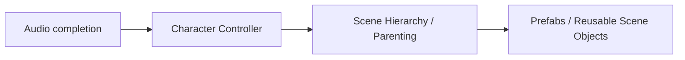

# Roadmap

Henka Engine is an early-stage open source C17 game engine and integrated development workspace. Current work combines runtime and integrity hardening, modeling and content authoring, terrain and world usability, renderer and asset maturity, and the next layers of 2.5D support.

> **Roadmap status:** This page describes direction and priority. It does not define a release schedule. Capability claims remain governed by the current implementation and the repository's capability documentation.

## Contents

- [Current focus](#current-focus)
- [Active major-system sequence](#active-major-system-sequence)
- [Near-term priorities](#near-term-priorities)
- [Character Controller](#character-controller)
- [Scene Hierarchy / Parenting Maturity](#scene-hierarchy--parenting-maturity)
- [Prefabs / Reusable Scene Objects](#prefabs--reusable-scene-objects)
- [Roadmap dependency map](#roadmap-dependency-map)
- [Workspace and tools](#workspace-and-tools)
- [Agent and automation interface](#agent-and-automation-interface)
- [Game authoring foundation](#game-authoring-foundation)
- [Asset and material workflow](#asset-and-material-workflow)
- [2D and 2.5D direction](#2d-and-25d-direction)
- [Integrated modeling and content authoring](#integrated-modeling-and-content-authoring)
- [Persistence and undo/redo](#persistence-and-undoredo)
- [Scripting and behavior authoring](#scripting-and-behavior-authoring)
- [Game-completion and future engine systems](#game-completion-and-future-engine-systems)
- [Platform targets](#platform-targets)
- [Release systems](#release-systems)
- [Roadmap completion principle](#roadmap-completion-principle)

## Current focus

Current work hardens runtime, workspace, renderer, platform, assets, physics, persistence, packaging, external-project paths, and the integrated authoring foundation already present in the Sandbox.

Current priorities include:

1. Stable engine startup and shutdown.
2. Clear platform, renderer, input, scene, camera, and authoring boundaries.
3. Reliable object and component selection and transform behavior.
4. Transactional modeling, UV, material, persistence, and undo/redo paths.
5. Terrain editing, streaming, collision, and visual validation.
6. Asset loading and material ownership with explicit failure behavior.
7. A packaged Sandbox with public setup and validation paths.
8. Documentation aligned with live product behavior.
9. Executable test coverage for core behavior.

## Active major-system sequence

The current major-system order is:

1. **Complete Audio** to its defined production boundary.
2. **Character Controller**.
3. **Scene Hierarchy / Parenting Maturity**.
4. **Prefabs / Reusable Scene Objects**.

Renderer, realism, modeling, terrain, 2D/2.5D, scripting, and other roadmap work remain active supporting tracks. The sequence identifies the lead major-system work after each clean completion boundary.

## Near-term priorities

1. Finish asset cache ownership, identity, retry, metadata, and failure-output contracts.
2. Continue recursive audits across rendering, platform, physics, persistence, scene, workspace, packaging, and external-project paths.
3. Keep viewport interaction helpers aligned with live Sandbox behavior and complete remaining manual transform QA.
4. Keep local and GitHub validation deterministic across build, tests, package provenance, packaged startup, repository integrity, and external-project checks.
5. Keep README, architecture, roadmap, runtime help, and repository description aligned with the implemented product.
6. Preserve stable identities, transactional editing boundaries, versionable data, and external-tool compatibility needed by 2.5D and later modeling.
7. Shape the Action API toward a versioned semantic agent surface after stable Scene Document identities, capability discovery, permission boundaries, dry-run behavior, auditability, and structured failure contracts are dependable.

## Character Controller

> **Status:** Foundation; full movement maturity is planned after the current Audio boundary.

The public Character Controller foundation currently supports a real dynamic
upright capsule body, bounded planar input, optional acceleration and
deceleration tuning, grounded jump queuing, stale-body rejection, explicit
teleporting through the physics transform contract, configurable slope-aware
grounding classification, accepted ground-normal reporting, and caller-owned
fixed-step participation. Full first-person, third-person, and general
character movement remains current development. Capsule half-height zero
remains sphere-equivalent for compatibility.

The runtime camera foundation now follows a live generation-checked scene
entity through target-local offsets, immediate positioning, and bounded
positional smoothing. Collision-aware camera motion, first-person and
third-person rigs, and camera blending remain current development.

### Target capability

The production foundation should cover:

- grounded detection and stable floor classification;
- walking and running with configurable acceleration and deceleration;
- jumping, falling, and gravity integration;
- configurable movement speed and movement policy;
- slope traversal, explicit slope limits, and surface response;
- stairs and bounded step handling;
- ledge and contact behavior;
- moving-platform participation;
- crouch and stand-clearance checks;
- collision recovery and wall/contact handling;
- configurable step height, skin/contact margin, and surface response;
- first-person and third-person use;
- keyboard, mouse, and gamepad integration through the real input boundary;
- one authoritative physics/movement relationship;
- animation hooks;
- Audio and footstep hooks;
- scripting/gameplay APIs;
- persisted authored settings;
- deterministic tests and real production-object integration tests;
- packaged and external-project validation;
- architecture compatible with later gameplay networking.

### Integration expectations

The controller must consume the same authoritative scene/entity, transform, input, camera, physics, Audio, scripting, and future animation boundaries used elsewhere in Henka. Completion evidence must exercise those production boundaries.

### Completion direction

A mature controller should remain stable across slopes, steps, moving platforms, pause/resume, scene save/load, runtime Play, package execution, and supported external projects. Blocked standing, invalid grounding, stale entity ownership, and unsupported movement states require explicit predictable outcomes.

## Scene Hierarchy / Parenting Maturity

> **Status:** Foundation; editor and cross-subsystem hierarchy maturity is planned after Character Controller.

The runtime hierarchy foundation establishes an authoritative composition model
for real Henka objects, including deterministic direct-child enumeration and
root enumeration. Editor hierarchy authoring, history, and participation across
all major subsystems remain planned work.

### Core hierarchy

The hierarchy should support:

- root, parent, child, sibling, and deeply nested descendant relationships;
- stable parent/child identity;
- deterministic traversal and ordering where ordering matters;
- cycle prevention and stale-parent rejection;
- safe mutation during editor and runtime operations;
- explicit ownership and destruction behavior;
- bounded traversal for malformed or hostile data.

### Transform authority

Local and world position, rotation, and scale must propagate through the hierarchy. Reparenting should support explicit **keep world transform** and **keep local transform** behavior where appropriate.

Rendering, physics, Audio, cameras, scripting, animation hooks, networking, persistence, and Play sessions must observe the same transform truth.

### Authoring and persistence

Hierarchy maturity includes:

- tree/outliner presentation;
- selection synchronization with the viewport;
- parent, unparent, reparent, duplicate, rename, and delete operations;
- subtree duplication with new stable identities and correct internal reference remapping;
- undo/redo for hierarchy edits;
- exact save/reload round trips;
- safe lifecycle behavior when roots, parents, children, or subtrees are destroyed;
- package and external-project verification.

Weapons attached to hands, Audio emitters attached to world objects, cameras attached to player rigs, and lights attached to vehicles should all consume this hierarchy.

## Prefabs / Reusable Scene Objects

> **Status:** Foundation; full reusable authored-object workflows are planned on the hierarchy foundation.

The runtime prefab foundation captures bounded scene snapshots and instantiates
independent normal Henka scene objects with traceable source relationships. It
also composes a captured root beneath a live scene entity using a local root
transform, which supports runtime attachment to existing gameplay hierarchies.
Persistent prefab assets, editor authoring, and source-change workflows remain
planned work.

### Core prefab capability

A prefab system should provide:

- stable prefab asset identity;
- traceable source-to-instance relationships;
- real scene-entity instantiation;
- preserved hierarchy and component data;
- explicit inherited and overridden values;
- instance-specific overrides;
- source-change propagation that preserves intentional overrides;
- structural reconciliation when children or components are added or removed;
- duplication, unpacking, and deliberate apply/revert operations;
- persistence of source identity, instance identity, mappings, overrides, and schema/version information;
- asset move/rename resilience through stable identity;
- cycle prevention for nested prefab dependencies;
- safe failure for missing, stale, corrupt, or unsupported sources;
- undo/redo participation;
- package and external-project validation.

### Composition direction

Prefab architecture should support nested reusable objects, controlled variants or an equivalent composition mechanism, runtime spawning, Character Controller integration, Audio emitters, scripting, imported assets, future networking, and future Smart Objects.

Advanced nested prefab and variant behavior may be staged. Unsupported behavior remains explicitly documented during staged development.

## Roadmap dependency map

Several later systems depend on shared foundations.

| Cluster | Dependency direction |
| --- | --- |
| Character gameplay | Character Controller → Input → Camera → Physics → Animation → Audio → Gameplay AI → Networking |
| Scene composition | Scene Hierarchy → Asset Identity → Prefabs → Persistence → Streaming → Smart Objects → Large Worlds |
| Content | Asset Pipeline → Materials → VFX → Vegetation → Water → Animation → Audio → Packaging |
| Game completion | Runtime UI → Input → Localization → Accessibility → Save Games → Project/Build/Export |
| Shipping and scale | Profiling → Loading/Streaming → Large Worlds → Packaging → Crash Diagnostics → Team Workflows |

The table expresses dependency leverage. Individual systems may overlap during development.

## Workspace and tools

Henka is building a practical developer workspace in layers.

### Current workspace foundations

1. Docked panels with a dedicated Scene View.
2. Native detached tool windows with matching production-panel content, close-to-redock recovery, bounded virtual-screen placement persistence, and title-bar drag-back recognition.
3. Resizable occupied dock regions, validated split topology, tab grouping/reordering, bounded layout history, named layout slots, and reset-layout recovery.
4. Scrollable panel bodies with bounded wheel/touchpad ownership, persistent collapsible property groups and scroll offsets, fixed panel headers, integrated scrollbar behavior, and bounded presentation-only Object Details group ordering.
5. Visible workspace and viewport interaction diagnostics.
6. A multi-window platform foundation with a separate native test panel for render and event-routing validation.

Current runtime foundations also include rigid-body physics v1: fixed-step worlds, static/dynamic/kinematic bodies, sphere/AABB/plane collision, impulse response, friction, restitution, trigger events, raycasts, opt-in Sandbox QA controls, and viewport selection highlighting for the selected real scene object.

Viewport/editor tooling is a Foundation with active usability work: Scene View,
Compass navigation, docked and detached panels, layout persistence, bounded
interaction diagnostics, and early authoring surfaces are implemented. Native
desktop feel, broader hierarchy/project workflows, numeric transform editing,
and complete manual interaction QA remain open.

### Planned workspace improvements

1. Complete native desktop feel and manual QA for detached controls and title-bar drag-back redocking.
2. Add an in-window controls editor for the existing local keybinding profiles.
3. Add a detachable Scene View after multi-window rendering and viewport input are dependable.
4. Mature Scene Hierarchy / Parenting on the available runtime foundation.
5. Add prefab editor authoring, persistence, and source-change behavior on the
   available runtime snapshot and hierarchy foundations.
6. Add numeric transform editing.
7. Extend undo and redo to more basic scene operations.
8. Extend settings/save-slot and HAMS authoring persistence into a complete scene/project save and load workflow.

## Agent and automation interface

Henka's local Action API already provides a useful architectural seam for agent-driven development. Tools and tests can submit validated engine operations and receive structured results through engine-owned authority.

The agent surface should expand as the underlying contracts become deterministic, inspectable, and safe.

### Readiness gates

An MCP-compatible agent adapter becomes appropriate after these foundations are dependable:

1. Action targets use persistent Scene Document identities.
2. Action schemas and capability discovery are versioned.
3. Authoring, scene, asset, Play-session, and inspection operations have explicit authority and transaction boundaries.
4. Requests support bounded validation, dry-run behavior where meaningful, structured failures, and sufficient result state.
5. Local permission and user-approval boundaries protect capabilities outside the exposed tool surface.
6. Agent actions produce auditable diagnostics compatible with the executable validation harness.
7. Visual evidence remains a separate authority for appearance, readability, anatomy, composition, material response, and other visual properties.

### Planned integration

Henka should expose the Action API through a thin standards-oriented adapter once those gates are met. The preferred direction is an MCP-compatible semantic tool surface for desktop development agents. WebMCP-compatible exposure can be evaluated when Henka has an appropriate browser or web-hosted surface.

Engine authority, validation, transactions, identity, undo boundaries, diagnostics, and test evidence remain inside Henka. The protocol adapter should stay transport-level infrastructure.

MCP and WebMCP continue to evolve. Henka should track stable capability-discovery, schema, permission, and transport conventions before committing the adapter.

Foreground mouse and keyboard automation remains useful for testing the human interface. Ordinary machine-driven scene, authoring, inspection, and validation work should use equivalent semantic engine actions when available.

## Game authoring foundation

> **Status:** Foundation

The Sandbox has a bounded Game Authoring V1 slice sharing Scene Document, runtime scene, physics, workspace, scripting, and persistence boundaries.

### Available

1. Persistent Scene Document object IDs mapped through a bounded adapter to generation-checked runtime entities.
2. Authored Physics and Interaction values in Object Details for registered scene objects.
3. Confined, checksummed `.hscene` Save Scene and Reload Scene operations with candidate validation and failure retention.
4. A dedicated Play session with Start, Pause, Resume, Step, Stop, an isolated runtime scene, and an active-session mutation/save barrier.
5. Bounded HenkaScript/Lua lifecycle adapters, a callable VM, language-neutral host schema, typed host dispatch, isolated Play Scene Document binding, bounded behavior state, and explicit mixed-language event routing.
6. Bounded Inspector creation and transactional attachment of Lua/HenkaScript behavior templates.
7. A bounded compiler-backed source editor with Edit, Save, Revert, and Reload actions plus compiler/backend diagnostics.
8. Candidate-first transactional behavior reload at the Play-session seam.

### In Progress

1. Broader registration and materialization of imported and externally-authored objects.
2. More complete source, renderer/material, hierarchy, and scene/project serialization while retaining runtime-resource ownership boundaries.
3. Numeric inspector editing, richer gameplay components, and expanded manual packaged validation.
4. Broader Inspector behavior authoring and debugger presentation.

### Planned

1. Hierarchy/scene-graph authoring and a complete project serializer.
2. Broader gameplay systems, input mapping, controllers, animation, and production game-debugging workflows.
3. Mature project-level scripting workflows beyond the current bounded foundation.

## Asset and material workflow

The asset pipeline has a manager-owned metadata, dependency, import, fallback, and material-instance foundation.

### Foundation

1. Asset metadata and texture dependencies are manager-owned and inspectable.
2. Bounded glTF/GLB scene/PBR import and bounded OBJ import are available within their documented interchange subsets.
3. Missing-asset fallback behavior is explicit and validated.
4. Texture dependencies, scalar/vector values, alpha mode, and semantic PBR material-instance overrides can be inspected and edited transactionally.
5. External templates have bounded asset-root and consumer-validation paths.

### Current development

1. Strengthen asset cache ownership, identity, retry, metadata, and failure-output contracts.
2. Expand texture/material assignment and material-editing usability while preserving manager ownership and transactional updates.
3. Improve external project configuration and asset-root guidance across the validated templates.

### Future work

1. Broader model import coverage beyond the current bounded glTF/GLB and OBJ subsets.
2. Dedicated user-authored material-file authority, text-entry import, drag/drop, and dependency-graph tooling.
3. Shader selection and procedural shader planning with safe parameter handling.

Procedural shader work should follow sufficient material-system maturity.

## 2D and 2.5D direction

Henka plans first-class 2D and 2.5D workflows.

### Planned 2D work

1. A dedicated 2D renderer path.
2. Sprites.
3. Texture regions.
4. Layers.
5. A 2D camera.
6. A focused 2D sample.

### Current 2.5D camera foundation

1. Perspective 3D, side, top-down, and isometric camera presets.
2. Stable exact-vertical top-down camera basis handling.
3. Orthographic zoom and frame-selected sizing.
4. Sandbox controls and local persistence for the selected camera preset.

### Next 2.5D work

1. Sprite-facing quad and texture-sampling foundations.
2. Transparent and cutout material render states.
3. Sprite and texture-region data.
4. Layered depth and deterministic sorting. The current renderer provides bounded transparent sorting; sprite/layer authoring remains future work.
5. Parallax.
6. Movement-plane and physics-axis constraints.
7. Tools for 2D-style layout in 3D space.

## Integrated modeling and content authoring

Integrated authoring is already underway alongside the 2D/2.5D roadmap. The camera-side
2.5D foundation and modeling foundation share renderer, asset, persistence, and
workspace boundaries.

### Implemented Foundation

1. Editable authoring data is separated from evaluated runtime meshes, render
   buffers, collision data, and material-instance state.
2. Objects and mesh elements use stable identities with connectivity, boundary,
   material-region, UV, smoothing, and hard-edge metadata.
3. Transactional authoring operations validate candidates before commit and
   provide bounded undo/redo plus evaluated mesh replacement.
4. Object, Vertex, Edge, and Face workflows include component selection,
   connected selection, bounded edge-loop/ring selection, soft movement, and
   axis-constrained movement.
5. Published Vertex operations include Merge Center, Merge Active, Merge by
   Distance, Connect Vertices, Dissolve Vertex, Delete Vertex, and Vertex Bevel.
   Bounded Vertex Extrude is available for connected open boundary vertex fans,
   including the one-face corner case. Closed, disconnected, loose-edge, and
   incompatible-normal fan cases fail closed; generalized Vertex Extrude remains
   future work.
6. Non-destructive topology analysis and explicit transactional safe repair are
   available. Repair can remove enabled isolated vertices, exact
   metadata-preserving duplicate faces, and degenerate faces. Unsafe winding,
   UV, material, smoothing, and non-manifold changes are rejected.
7. Face winding flip, face extrude, inset, planar bevel rings, face subdivision,
   selected-face deletion, planar UV projection, island transforms, packing,
   seam detection, Make Editable, HAMS persistence, material promotion, and
   supported PBR material-instance editing are available in the bounded
   workflow.
8. HAMS preserves explicit loose vertices and standalone wire edges with stable
   IDs and bounded reusable storage. The topology overlay presents those source
   vertices and wire edges for inspection.
9. The shared modeling-operator session and Authoring panel provide bounded
   explicit-axis extrusion for one selected loose vertex or standalone edge
   with numeric Preview, Cancel, and transactional Apply.
10. Homogeneous wire-only and isolated-vertex-only sources have bounded
    renderer-backed line and point evaluation. Mixed surface/wire/point sources
    use bounded multi-primitive renderer ownership without dropping valid loose
    components.
11. glTF/GLB and OBJ import remain supported production boundaries with the
    documented interchange and authoring limitations.

### Current Development

#### Edge topology and authoring UX

- Bounded single-edge dissolve and single-edge deletion of an incident face set
  are available within their supported domains.
- Standalone boundary-edge bevel, bounded multi-edge boundary bevel,
  same-face boundary bevel with shared-endpoint corner caps, and compatible
  interior-edge bevel for an isolated two-quad patch are available.
- One Loop Cut accepts a validated factor across a compatible open quad strip or
  closed ring with Preview/Refresh and explicit Apply/Cancel publication.
- Edge mode provides signed-factor Edge Slide for one compatible open edge-loop
  or closed edge-cycle selection through the shared modeling operator session.
- Broader interior-edge cases, edge-loop domains, generalized Edge Extrude, and
  general loop-cut networks remain in progress or planned.

#### Loose-component and surface-connected editing

- Bounded surface-connected extrusion for one open boundary edge is available
  through the shared modeling session and Authoring panel.
- Homogeneous line/point evaluation and bounded triangle/wire/point renderer
  ownership are available.
- Broader loose-component selection and editing workflows remain in progress.

#### Cross-cutting authoring work

- Strengthen transactional modeling, UV, material, persistence, and undo/redo
  paths with fail-closed failure behavior.
- Improve editor integration, authoring source/project workflows, and usability
  of existing operations.
- Keep showcase fixture provenance and production-quality authoring claims
  explicitly classified.

### Future Work

1. Generalized Vertex Extrude beyond connected open boundary fans, broader
   non-manifold or incompatible-normal fan handling, and broader vertex topology
   operations.
2. Generalized surface-connected Edge Extrude, broader edge-set operations,
   weld/split/bridge workflows, general loop-cut networks, and broader source
   export.
3. Automatic multi-island UV unwrap, texture painting, rigging, skinning, and
   animation authoring.
4. Complete scene/project serialization and wider adapter-based interchange
   beyond the current bounded paths.

2D and 2.5D remain first-class roadmap work. Future sprite, layer, parallax,
animation, and movement-constraint systems share foundations with the
integrated authoring work already present.

## Persistence and undo/redo

### Foundation

Settings and save slots use confined paths, bounded identifiers, validated records, same-directory temporary files, flush/close-before-replace behavior, and failure retention of prior in-memory state.

Versioned HAMS authoring sources, bounded authoring project save/reload, the checksummed V1 `.hscene` Scene Document path, material history, and workspace layout history are also available.

### Current Development

The next persistence work extends these bounded foundations into broader scene/project data, imported-object and component coverage, more complete authoring history, and durable cross-workflow versioning while retaining transactional failure behavior.

### Future Work

A complete project-wide authoring serializer, hierarchy/project manifests, and remote or network-backed save policy remain future work beyond the current HAMS and V1 `.hscene` foundations.

## Scripting and behavior authoring

### Implemented Foundation

1. A versioned, language-neutral Script Host schema provides bounded typed gameplay API identities and diagnostics.
2. HenkaScript has a bounded lexer, parser, type checker, callable bytecode path, and allocation-free budgeted VM.
3. Lua 5.4.8 and HenkaScript have bounded lifecycle adapters for `OnCreate`, `OnStart`, `OnUpdate`, `OnFixedUpdate`, targeted interaction/contact signals, `OnDestroy`, and `OnStop`, with fail-closed budgets and deterministic missing-handler behavior.
4. The generation-checked behavior runtime owns lifecycle state, borrowed callbacks, synchronous non-reentrant dispatch, targeted authored-entity signal delivery, failure accounting, and bounded batch reports.
5. Scene Document behavior attachments persist stable IDs, enabled state, language identity, and confined project-relative `.lua`/`.hks` paths. The bounded asset loader validates those paths and source limits, owns each selected backend, and exposes mixed-language runtime descriptors.

### Current Development

#### Runtime and host boundaries

- Generalize runtime-entity and physics-body identity mapping around the Scene Document behavior runtime while keeping isolated Play-scene dispatch unable to mutate authoring state. The current bounded Play mapping is available foundation work.
- Extend the typed, non-reentrant Script Host dispatcher beyond the current Entity/Transform/Physics/Event slice and resolve required API bindings at load time.

#### Persistence and authoring ergonomics

- The bounded state store and explicit sidecar save/load seam are available.
- Inspector template authoring and transactional attachment are available.
- A bounded editable, compiler-backed source panel provides compiler-derived HenkaScript spans, diagnostics, and Save/Revert.
- Candidate-first transactional behavior reload is available at the Play-session seam.
- The source-panel Reload action is available.
- Broader Inspector authoring and debugger presentation remain in progress.

#### Events and lifecycle diagnostics

- Bounded queueing, Lua/HenkaScript emission, and `OnEvent` routing are available foundation work.
- Richer subscriptions, tooling, and lifecycle diagnostics remain open.

### Future Work

1. End-user project scripting workflows, debugger/diagnostic presentation, broader host APIs, and a stable script package/versioning policy.
2. Sandboxed script data schemas, deterministic replay integration, and wider editor tooling once the scene binding contract is stable.

## Game-completion and future engine systems

The following systems are part of Henka's broader direction. Their entries define planned work and do not change current capability status.

### Gameplay and player-facing systems

| System | Direction |
| --- | --- |
| **Runtime Game UI / HUD** | Fonts/text/Unicode, images, layout and anchors, HUDs, menus, widgets, inventory, dialogue, subtitles, tooltips, keyboard/gamepad/mouse/touch navigation, DPI handling, styling, accessibility, scripting, persistence, and animation. |
| **Full Input / Device System** | Keyboard, mouse, gamepad, hotplug, remapping, actions/axes, deadzones, curves, chords, hold/toggle behavior, local multiplayer assignment, haptics, accessibility, UI navigation, prompts, and scripts. |
| **Runtime Save Game System** | Save slots, checkpoints, profiles, settings, developer-defined state, entity/inventory/world state, versioning, migration, corruption recovery, atomic writes, autosave, and script access. |
| **Navigation / Gameplay AI** | Navmesh/pathfinding, queries, dynamic obstacles, steering, avoidance, crowds, line of sight, perception, patrol, navigation links, off-mesh traversal, behavior/state logic, debug tools, scripts, animation integration, and budgets. |
| **Runtime Camera Framework** | First-person, third-person, orbit, tracking, collision, smoothing, FOV, shake, blends, stacks, scripted/cinematic cameras, and split-screen groundwork. |
| **General Gameplay Infrastructure** | Layers, tags, component queries, metadata, events/messages, timers, delays, spawn/despawn, pooling, scene transitions, loading screens, async loading, background streaming, project settings, CVars, developer console, capture, and recovery hooks. |

### Physics, simulation, and world interaction

| System | Direction |
| --- | --- |
| **Advanced Physics Maturity** | Layers/masks, triggers, more shapes, compound colliders, CCD, joints, constraints, motors, springs, sleep, materials, moving platforms, controller support, ragdolls, vehicles, filtering, overlap/sweep queries, and diagnostics. |
| **Particles / VFX** | CPU/GPU particles, emitters, bursts, sprites/meshes, trails/ribbons, curves, forces, collisions, subemitters, flipbooks, decals, impacts, smoke, fire, sparks, weather, editor tooling, scripting, and performance controls. |
| **Decals / Projected Effects** | Impacts, dirt, blood, wetness, signage, graffiti, roads, damage, and local material effects through the real renderer. |
| **Vegetation / Foliage** | Grass, trees, shrubs, scatter, density, biomes, terrain integration, wind, interaction, LOD, culling, instancing, streaming, collision, shadows, and seasonal variation. |
| **Water** | Lakes, rivers, oceans, materials, waves, reflection/refraction, shoreline behavior, underwater rendering, depth/fog, buoyancy, gameplay interaction, wetness, terrain/weather integration, and scalability. |
| **Destruction / Breakables** | Break states, fracture/debris, physics, damage, VFX, Audio, persistence, scripting, networking, pooling, and future Smart Object semantics. |
| **Smart Assets / Smart Objects** | Semantic reusable objects whose physical/material/audio/VFX/gameplay properties drive real subsystem interactions such as fire, water, electricity, breakage, weather, pressure, and environmental response. |

### Content production and cinematic systems

| System | Direction |
| --- | --- |
| **Production Asset Database / Import Pipeline** | Stable IDs, source vs. derived assets, import/reimport, dependencies/invalidation, metadata, thumbnails, missing references, duplicate detection, move/rename, search/tags, cache/cook, hot reload, provenance/licensing, packaging, and large-project scaling. |
| **Material / Shader Authoring UX** | Material instances/functions, exposed parameters, live preview, textures, diagnostics, composition, graph or equivalent authoring, custom shader path, performance visibility, and generated-shader inspection. |
| **Cinematic / Sequencer** | Cameras, cuts, blends, animation, Audio, dialogue, events, activation, transforms, material/light changes, fades, VFX, scripts, and scene transitions. Scope is game cinematics and sequenced game events. |
| **Animation and character production** | Rigging, skinning, animation authoring, runtime animation systems, events, controller integration, and eventual character-generation workflows built on real Henka assets. |
| **Interactive Media & Streaming** | Local/network video to Henka textures/materials, provider-aware sources through permitted APIs/embed rules, controls, buffering/reconnect, adaptive streams, Audio routing, 3D positional Audio, scene persistence, scripting, and security/DRM/auth boundaries. |

### Networking and runtime scale

| System | Direction |
| --- | --- |
| **Gameplay Networking Above ENet** | Entity identity/replication, RPC/events, ownership/authority, relevancy, snapshots, interpolation, prediction/reconciliation, lag compensation, join-in-progress, scene sync, spawning, bandwidth/priorities, reconnect, sessions/lobbies, diagnostics, and controller integration. |
| **Large World Infrastructure** | World partition, origin rebasing or another precision strategy, async cell/asset/entity streaming, distance simulation, navigation, Audio, physics, save partitioning, and multiplayer relevancy. |
| **Loading / Streaming Architecture** | Unified asynchronous loading for assets, textures, models, scenes, terrain, Audio, animation, shaders, and world regions with cancellation, priorities, progress, dependencies, bounded memory, recovery, and thread-safe ownership. |
| **Replay / Deterministic Gameplay Capture** | Record inputs, events, state, timing, and network behavior for reproducible bugs, regressions, performance analysis, visual/gameplay review, and networking validation. |

### Shipping, extensibility, and developer workflow

| System | Direction |
| --- | --- |
| **Project / Build / Export Experience** | New-project flow, templates, project settings, targets/configurations, cook/build/package/run, platform presets, icons, versioning, dependencies, portable output, reproducibility, and external-project support. |
| **Profiling / Performance Tooling** | CPU, GPU, frame, memory, allocations, assets, textures, passes, draws, triangles, Audio, physics, scripts, networking, terrain, scenes, and frame captures. |
| **Developer Console / Runtime Debug Commands** | Commands, CVars, inspection, toggles, diagnostics, performance data, gameplay controls, log filters, dev-only safe commands, and script access with secure shipping behavior. |
| **Crash / Recovery / Diagnostic Pipeline** | Crash detection/context, build identity, project/scene context where safe, log preservation, recovery/autosave, privacy-aware diagnostic bundles, and readable reporting. |
| **Plugin / Extension SDK** | APIs, manifests, discovery, lifecycle, versions, dependencies, importers, components, editor/runtime extensions, permissions, docs, examples, and migration. |
| **Source Control / Team Workflow Support** | Deterministic serialization, stable IDs, minimal churn, merge-friendly formats, conflict handling, locks where needed, external modifications, and multi-user/source-control-neutral workflows. Built-in Git integration is optional. |
| **Modding / Runtime Extension Boundary** | Optional content packs, scripts, namespaces, sandboxing, permissions, versioning, dependencies, load order, and safe public game APIs. |

### Localization and accessibility

| System | Direction |
| --- | --- |
| **Localization** | String tables, locales, Unicode, plural handling, font fallback, localized assets/Audio/subtitles/dialogue, language switching, RTL groundwork, and missing-translation diagnostics. |
| **Game-facing Accessibility Framework** | Subtitles/captions, scalable UI, contrast and color-vision support, reduced motion/camera options, hold/toggle alternatives, remapping, visual/audio equivalents, and clear prompts. |

These systems should be prioritized by maturity, dependency leverage, and downstream unlock value.

## Platform targets

Henka's platform plan is explicit and staged.

| Platform | Direction |
| --- | --- |
| **Windows 64-bit** | Current validated primary desktop development and packaging target. |
| **Linux 64-bit** | Planned validated desktop and headless/server target. |
| **macOS** | Planned future desktop target. Renderer architecture should support a Metal-oriented production path. |
| **Android / iOS** | Evaluation after desktop platform and renderer abstraction maturity. |
| **Consoles** | Evaluation through platform-holder requirements and available SDK access when the engine reaches appropriate maturity. |
| **Web / WebAssembly** | Evaluation after runtime, renderer, threading, asset, and browser-hosting constraints are understood. |

### Renderer direction by desktop platform

| Platform | Renderer direction |
| --- | --- |
| **Windows** | Current OpenGL path; future Vulkan and Direct3D 12 backends through explicit backend isolation. |
| **Linux** | Vulkan as the preferred future modern backend, with OpenGL retained where practical. |
| **macOS** | Metal as the long-term native renderer direction. OpenGL is legacy on macOS. MoltenVK may be evaluated where it provides clear maintenance or portability value. |

### Platform acceptance

A platform becomes supported only after its claimed boundary has executable validation covering the relevant areas:

- configure and build;
- automated tests;
- runtime startup and shutdown;
- editor/workspace behavior where applicable;
- renderer and presentation where applicable;
- windowing and input;
- Audio;
- persistence and filesystem behavior;
- packaging and portable execution;
- external-project consumption;
- dependency acquisition and licensing;
- failure and recovery behavior.

Support labels should identify partial boundaries clearly. A headless/server path may mature before the graphical editor path on the same operating system.

## Release systems

Longer-term release work includes:

1. Additional scripting languages or extension support beyond the bounded V1 Lua and HenkaScript foundations.
2. Additional renderer backends and backend isolation for platform-specific APIs.
3. Release packaging and distribution.
4. Versioned builds.
5. Checksums and release verification.
6. Provenance for release artifacts.
7. Continued Audio maturity through remaining device lifecycle, streaming, format, editor, scripting, and packaged end-user workflow gaps until the Audio scope reaches its defined completion boundary.

These systems affect project structure, compatibility, safety, and long-term maintenance and require explicit design and validation contracts.

## Roadmap completion principle

An API, UI panel, test fixture, metadata record, or demonstration establishes only the scope it actually exercises.

A completed roadmap capability requires a real production subsystem, the intended user or external-consumer workflow, executable regression coverage, and the applicable persistence, packaging, platform, visual, auditory, performance, security, or external-project evidence.
