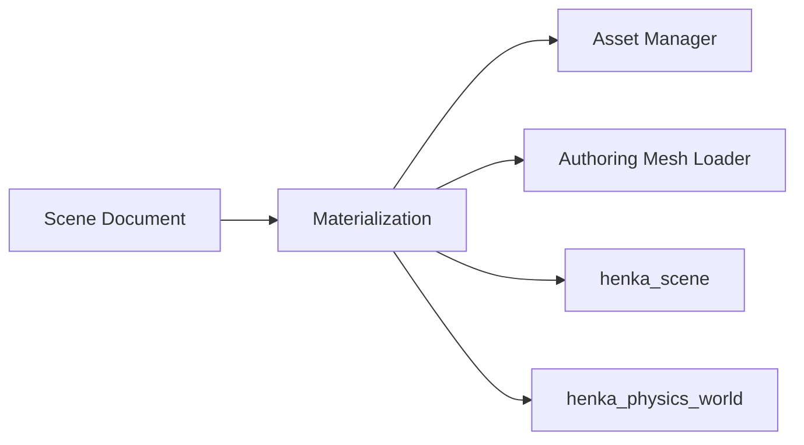
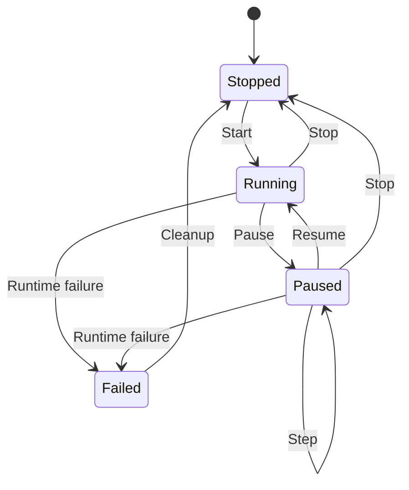

# Scene Authoring Architecture

> **Status:** Game Authoring Foundation architecture

This document defines the durable ownership, identity, persistence, Play-session, and input boundaries used by Henka's current scene-authoring foundation.

## Contents

- [Object identity](#object-identity)
- [Scene Document ownership](#scene-document-ownership)
- [Runtime materialization](#runtime-materialization)
- [`.hscene` representation](#hscene-representation)
- [Authored components and runtime state](#authored-components-and-runtime-state)
- [Play-session lifecycle](#play-session-lifecycle)
- [Input ownership](#input-ownership)
- [Module boundaries](#module-boundaries)

## Object identity

One authored object has two identities with different lifetimes.

| Identity | Owner | Lifetime | Serialized |
| --- | --- | --- | --- |
| `henka_scene_document_id` | Scene Document | Stable across save/load and editor sessions | Yes |
| `henka_entity` | Runtime scene | Generation-checked runtime lifetime | No |

Duplicating an authored object allocates a new persistent Scene Document ID.

The Sandbox adapter maintains a bounded mapping from persistent IDs to current runtime entities. The Scene Document remains the authoring authority.

### Binding after reload

Bindings are restored by persistent ID first.

A missing ID may use a unique authored object name as a bounded recovery key. Ambiguous names reject the candidate document and preserve the active state.

## Scene Document ownership

The Scene Document contains pure authoring data.

It owns:

- bounded object records;
- source references;
- transforms;
- renderer references expressed as authoring values;
- authored component values;
- persistent object identity.

Runtime resources remain under their existing subsystem owners.

The Scene Document stores no:

- renderer resource pointers;
- asset-manager entry pointers;
- physics body handles;
- UI state;
- raw runtime pointers;
- `henka_entity` handles.

### Source references

Source references use explicit kinds:

- **None**
- **Primitive** with validated primitive parameters
- **Authoring mesh** with a confined project-relative source path
- **Asset** with a confined project-relative asset reference and asset kind

### Authored interaction data

Interaction authoring uses `henka_interaction_desc` values.

### Authored physics data

Physics authoring stores value-only component data that can be translated into `henka_physics_body_desc` for the existing `henka_physics_world` runtime.

## Runtime materialization

The runtime materialization layer resolves Scene Document references through existing production systems:

Asset-manager resources remain manager-owned borrowed objects.

A failed materialization keeps the active scene intact. Candidate state is validated before publication.

## `.hscene` representation

Scene Document V1 uses a deterministic little-endian binary format with the `HSCN` magic.

The format matches the repository's existing bounded persistence model: explicit fields, versioning, checksums, bounded records, candidate validation, and atomic replacement.

### V1 record contract

The format provides:

- a documented header containing magic, format version, header size, payload size, object count, and checksum;
- explicit field encoding;
- fixed bounds for object count, strings, references, and total file size;
- canonical object ordering;
- canonical field ordering;
- finite-number validation;
- enum validation;
- ID validation;
- path validation;
- cross-reference validation;
- rejection of truncated, trailing, or V1-invalid records;
- candidate-first transactional loading;
- same-directory temporary writes followed by platform-aware atomic replacement.

Native C struct layouts and pointers are never serialized.

### Inspection

The public document API provides bounded inspection data for tooling, including:

- header information;
- version;
- object IDs;
- source kinds;
- authored component presence.

### Version migration

V1 code rejects newer unsupported format versions. Future loaders may validate an older format, migrate it into the current in-memory schema, and publish the migrated candidate only after successful validation.

Semantic round-trip tests are part of the format's release requirements.

## Authored components and runtime state

The Inspector edits the Scene Document and its current authoring representation only while the editor is in an authoring state.

Component changes follow a candidate transaction that publishes dependent scene, bounds, material, and collider updates together.

### Physics

Authored physics data includes:

- body type;
- collider shape and dimensions;
- trigger state;
- collision masks/layers;
- material values.

Runtime-only physics state includes:

- body IDs;
- contact history;
- Play-generated velocities;
- runtime pointers.

### Interaction

Authored interaction data includes:

- enabled state;
- prompt;
- interaction distance.

The existing scene interaction descriptor remains the runtime contract.

## Play-session lifecycle

Play is owned by a focused Play-session module.

### Start

Starting Play:

1. validates authored scene data;
2. clones the authored scene into an independent runtime scene;
3. preserves the persistent-ID mapping needed by runtime systems;
4. materializes runtime bodies against the runtime scene;
5. borrows existing renderer-owned resources through their normal ownership contracts.

### Run, pause, resume, and step

The Play session owns runtime lifecycle state and bounded fixed-step progression.

### Stop

Stopping Play:

1. destroys runtime bodies and Play-owned runtime resources;
2. discards the isolated runtime scene;
3. retains authored Scene Document state unchanged.

### Authoring lock while Play is active

Scene mutations, Save Scene, and Reload Scene are rejected while Play is running or paused.

Runtime transforms, velocities, contacts, body IDs, and other simulation state are excluded from authored persistence.

Materialization and fixed-step failures move the Play session into a failed state. Cleanup retains authored state.

## Runtime hierarchy foundation

The public runtime scene supports a bounded parent/child relationship using the
same generation-checked `henka_entity` handles used for ordinary scene access.
Each entity retains a local transform and a derived world transform. Local
updates propagate through the active subtree, while world-transform updates
derive a validated local transform relative to the current parent.

Reparenting explicitly selects `HENKA_SCENE_PARENT_KEEP_LOCAL` or
`HENKA_SCENE_PARENT_KEEP_WORLD`. Invalid parents, stale handles, cycles, and
updates that would make a bounded TRS transform non-representable are rejected
before the relationship changes. The current TRS foundation accepts uniform
parent scale for hierarchy composition; shear-producing non-uniform parent
scale is not approximated. Destroying a parent promotes its direct children to
roots while preserving their world transforms, and stale parent handles cannot
be reused.

HSCN v6 persists parent IDs and validates references and cycles during load;
v1-v5 documents migrate to root objects in memory without being rewritten.
Sandbox hierarchy editing, hierarchy history, and participation by every
runtime subsystem remain subsequent work. The runtime foundation is independent
of the selection-owner relationship used for editor presentation.

## Input ownership

### Scene View navigation

Scene View right-mouse navigation is application-local.

A press inside Scene View creates an interaction candidate. Movement beyond the four logical-pixel threshold commits the pan and retains ownership until release. Camera and navigation-target movement use `henka_camera_pan_target`.

Higher-priority interaction owners include:

- panels;
- active transforms;
- engine mouse capture;
- automation input ownership;
- other explicit editor transactions.

A click that stays within the drag threshold preserves the existing context-click behavior.

### Automation input

When automation ownership is enabled, the platform uses a separate logical pointer state and accepts bounded fully parsed events from the configured test stream.

During automation ownership:

- main-window physical pointer motion is ignored by application interaction;
- physical mouse buttons are ignored by application interaction;
- physical wheel input is ignored by application interaction;
- ordinary physical keys are ignored by application interaction;
- physical `Escape` remains the emergency abort;
- focus loss releases held logical buttons and keys;
- malformed automation events fail closed and request shutdown;
- engine teardown releases automation ownership.

The packaged PowerShell gate uses this logical stream for deterministic interaction validation.

## Module boundaries

Substantial behavior belongs in focused engine or Sandbox modules.

The Sandbox executable remains the composition root. Current scene-authoring work is split across focused boundaries for:

- Scene View navigation;
- persistent-ID mapping;
- Inspector component transactions;
- Play-session lifecycle;
- runtime materialization;
- persistence and validation.

Large unrelated `main.c` rewrites are outside this architecture direction.
